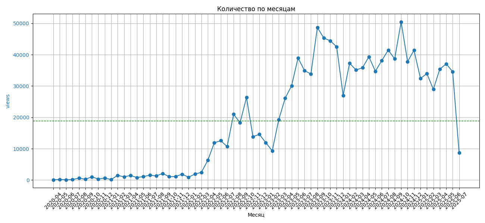
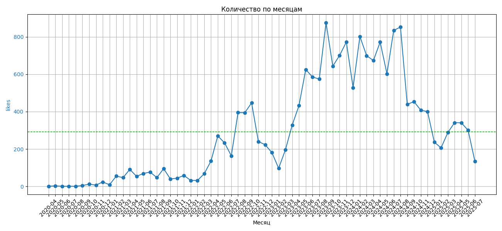
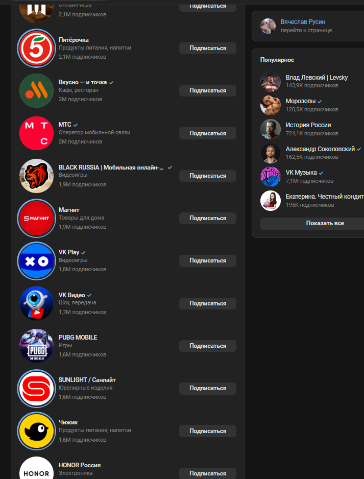
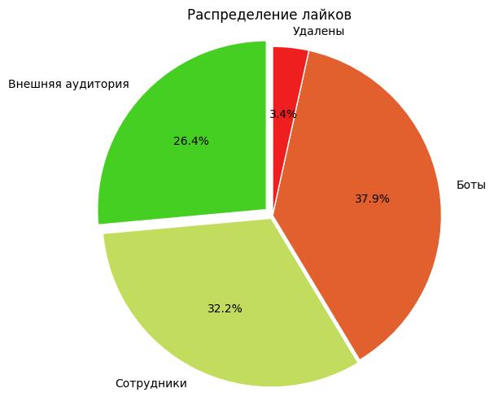
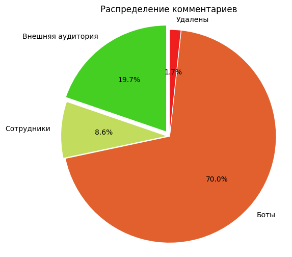
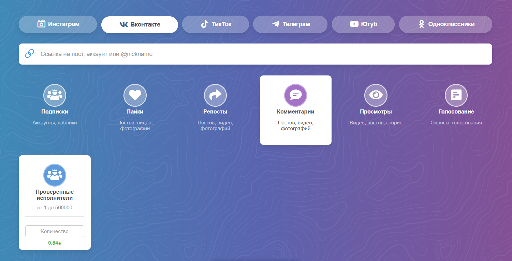

# АНАЛИЗ АКТИВНОСТИ ПОЛЬЗОВАТЕЛЕЙ В СООБЩЕСТВЕ ВКОНТАКТЕ  

## Содержание  
1. [Введение](#введение)  
2. [Подготовка данных](#подготовка-данных)    
3. [Анализ публикаций](#анализ-публикаций)  
4. [Анализ аудитории](#анализ-аудитории)
    - [комментаторы](#комментаторы)
    - [лайкеры](#лайкеры)
    - [коммуникативное ядро](#коммуникативное-ядро)
    - [гипотеза](#гипотеза)  
5. [Стоимость активной аудитории](#стоимость-активной-аудитории)
6. [Заключение](#заключение)
7. [Ссылки на литературу](#ссылки-на-литературу)  

## Введение  

Цель исследования заключается в анализе активности пользователей сообщества ВКонтакте, выявлении коммуникативного ядра и внешней вовлеченной аудитории. Определение процента искусственно созданной активности. Оценка стоимости искусственного формирования активности аудитории сообщества.  

В исследовании активности сообщества и пользователей использованы алгоритмы сбора, изменения представления и категоризации данных. Алгоритмы реализованы на языке Python версии 3.10, описание и программный код функций представлены в файле [functions.ipynb](./functions.ipynb).  

В анализе активности самого сообщества применялись формулы расчета среднего, стандартного отклонения и коэффициента вариации:
$\bar{x} = \frac{1}{n} \sum_{i=1}^{n} x_i$ - расчет среднего, как среднего арифметического;  
$s = \sqrt{\frac{1}{n-1} \sum_{i=1}^{n} (x_i - \bar{x})^2}$ - стандартное отклоение;  
$CV_{\%} = \frac{\sigma}{\mu} \times 100\%$ - коэффициент вариации.  

Также использовалось среднее арифметическое значений $x_i$, для которых $x_i > L$, можно записать как:  
$\bar{x}_{x > L} = \frac{\sum_{i=1}^{n} (x_i \text{ if } x_i > L \text{ else } 0)}{\text{Count of } x_i \text{ where } x_i > L}$.  

Для оценки аудтории сообщества использовалась методология, предложенная в [1](https://www.mdpi.com/1999-5903/13/11/297).  

Путем определения средних арифметических значений по количеству оставленных комментариев и отметок "нравится", в таблицы ["комментаторов"](./data/comments.xlsx) и ["лайкеров"](./data/likers.xlsx) внесена информация о принадлежности пользователей к классам:
- Observer;
- SubActive;
- Active;
- SubLeader;
- Leader;  

где Observer (наблюдатель) - класс наименее активных пользователей, оставивших 1-2 комментария/лайка, а класс Leader (лидер) представляет собой группу наиболее активных пользователей.  

Кроме того проведен лингвистический и стилометрический (предложенный в [2](https://habr.com/ru/articles/536858/)) анализ текстов постов и комментариев для выявления наиболее интересных аудитории тем.  


## Подготовка данных  

Собрана информация об активности сообщества в период с апреля 2020 по начало июля 2025 года, получены таблицы, содержащие информацию об активности поьзователей сообщества ВК.  
Таблица с ихсходными данными содержала поля:
- “id” – номер записи;
- “parent_id” – идентификатор группы;
- “parent_type” – пост/комментарий в формате 0/1;
- “wall_id” – идентификатор группы и поста в группе;
- “attachments” – вложения, ссылки на вложения;
- “attachments_count” – количество вложений;
- “comments” – количество комментариев;
- “crc” – контрольная сумма текста сообщения;
- “unixdate” – дата и время в unix формате;
- “email” - упомянутые адреса электронной почты;
- “from_id” – id автора сообщения;
- “htags” - использованные теги;
- “is_repost” - является ли репостом (0/1);
- “likes” – количество отметок «Нравится»;
- “parent_data” - информация о стране и городе, присвоенных автору/группе (у всех одинаков);
- “reposts” - количество репостов;
- “text” – текст сообщения;
- “upd” - время сбора сообщений unixtime;
- “url” - url-ссылки, использованные в сообщении;
- “views” – количество просмотров;
- “whom” - id упомянутых пользователей/сообществ;
- “message_url” - url сообщения;
- “message_type” – тип сообщения «пост» или «комментарий»;
- “sn” – единица.  

Для анализа активности пользователей в сообществе не информативные столбцы удалены, данные обезличены, а также добавлены столбцы: 
- “date” – дата в формате дд.мм.гггг;
- “time” – время в формате чч:мм.  

Получена [тестовая таблица](./data/test.xlsx), которая использовалась для дальнейшего составления выборок и анализа.  
Также использовалась таблица likes, состоявшая из 2 столбцов, в первом из которых указан id пользователя, а во втором количество отметок "Нравится", оставленных им на постах сообщества.  

Для получения репрезентативной выборки, проведен анализ на количество просмотров постов. Путем отсечения аномально популярных записей, получена [репрезентативная выборка](./data/representative.xlsx).  

Для сбора имен и дат регистрации пользователей использована функция get_vk_info_selenium() из [блокнота](functions.ipynb). В последствии данные обезличены, т.е. во всех таблицах, предложенных в папке /data удалены имена и ссылки на личные страницы, каждому пользователю присвоен уникальный идентификатор в столбце deperson_id.

```Python 3.10
output_excel_file = 'comments.xlsx' # Имя файла для сохранения обновленных данных
checkpoint_interval = 20 # Интервал для сохранения (каждые 10 записей)
# Загрузка таблицы
try:
    df_test = pd.read_excel('comments.xlsx')
    print("Исходная таблица загружена.")
    print(df_test.head())
except FileNotFoundError:
    print("Ошибка: файл не найден.")
    exit
# Инициализируем колонки, если их нет
if 'name' not in df_test.columns:
    df_test['name'] = None
if 'reg_date' not in df_test.columns:
    df_test['reg_date'] = None
print("\nНачинается сбор данных. Результат будет сохраняться каждые", checkpoint_interval, "записей.")
print("Прогресс:")
for index, row in df_test.iterrows():
    # Пропускаем уже обработанные записи, если столбец 'name' не пустой
    if pd.notna(row['name']) and row['name'] != 'Имя пользователя не найдено' and not str(row['name']).startswith('Не удалось'):
        print(f"Пропускаем {row['from_id']} (уже обработано).")
        continue
    vk_link = row['from_id']
    print(f"  Обработка: {vk_link} (строка {index+1}/{len(df_test)})")
    info = get_vk_info_selenium(vk_link)
    if info and 'error' not in info:
        df_test.loc[index, 'name'] = info.get('name', 'N/A')
        formatted_date = format_date(info.get('reg_date_text', ''))
        df_test.loc[index, 'reg_date'] = formatted_date
    else:
        df_test.loc[index, 'name'] = info.get('error', 'Ошибка получения данных')
        df_test.loc[index, 'reg_date'] = None
    # Добавляем небольшую задержку, чтобы не перегружать сервер
    time.sleep(0.2) 
    # Проверяем, нужно ли сделать чекпойнт
    if (index + 1) % checkpoint_interval == 0:
        print(f"\n--- Чекпойнт: Обработано {index + 1} записей. Сохранение в '{output_excel_file}' ---")
        df_test.to_excel(output_excel_file, index=False)
        print("--- Сохранение завершено. Продолжаем. ---")
# Сохранение оставшихся данных после цикла
print("\nЦикл обработки завершен. Сохранение финальных данных в", output_excel_file)
df_test.to_excel(output_excel_file, index=False)
print(f"Финальные данные сохранены в '{output_excel_file}'")
```  

## Анализ публикаций  

Проведен анализ по количеству постов в месяц и в неделю (функция graph_avg_month в [блокноте](./functions.ipynb)).  
На рисунках ниже показано количество постов, просмотров и лайков за каждый месяц исследуемого периода. Зеленой пунктирной линией отмечено среднее значение рассматриваемой величины за весь период.  

<p align="center">
  
</p>
<div style="text-align: center; margin-top: -20px; margin-bottom: 30px;">
  Рисунок 1: Количество постов в месяц.
</div>  

<p align="center">
  
</p>
<div style="text-align: center; margin-top: -20px; margin-bottom: 30px;">
    Рисунок 2: Количество просмотров в месяц
</div>  

<p align="center">
  
</p>
<div style="text-align: center; margin-top: -20px; margin-bottom: 30px;">
    Рисунок 3: Количество лайков в месяц
</div>  

Из графиков видно, что основная активность приходится на 2023-2024 годы, в то время как в 2020-2021 годах активность сообщества была значительно ниже, чем в последующих. Активность пользователей в период с февраля по сентябрь 2023 резко возрастает.  

Обратим внимание на график, показывающий количество постов различной популярности исходной выборки:
<p align="center">
  
</p>
<div style="text-align: center; margin-top: -20px; margin-bottom: 30px;">
    Рисунок 4: Распределение количества просмотров
</div> 
Количество постов с >1000 просмотров: 211  
Процент постов с >1000 просмотров от общего количества постов: 7.58%  

Расчитано стабильное количество постов в месяц в неделю:  
```Python 3.10
stable(file='test.xlsx')
```  

Стабильное (среднее) количество постов в месяц: 43.50  
Стандартное отклонение: 33.41  
Коэффициент вариации: 76.8%  
Стабильное (среднее) количество постов в неделю: 10.92  
Стандартное отклонение по неделям: 8.06  
Коэффициент вариации по неделям: 73.8%  

Также получено среднее количество просмотров:  
```Python 3.10
avg1, avg2, avg3, avg4, avg5=avg('test.xlsx')
print(' Средние количества просмотров за весь период: \n Первое среднее: ', avg1, '\n Второе среднее: ', avg2,
'\n Третье среднее: ', avg3, '\n Четвертое среднее: ', avg4, '\n Пятое среднее: ', avg5)
```  
Средние количества просмотров за весь период:  
- Первое среднее:  1495.15  
- Второе среднее:  503.32  
- Третье среднее:  311.74  
- Четвертое среднее:  171.71  
- Пятое среднее:  72.91  

Рассмотрим количество постов, относящихся к популярным событиям: розыгрышам, конкурсам, онлайн и оффлайн мероприятиям:  

```Python 3.10
stop_words = {'lottery': ['розыгрыш', 'разыгрываем', 'разыграем', 'победитель', 'конкурс', 'поздравляем', 'получить', 'выиграть', 'шанс', 'подарим', 'подарок'],
'event': ['приглашаем','приглашение', 'оффлайн', 'онлайн', 'заявка', 'заявок', 'заявки', 'интенсив', 'открытый', 'юбилей']}
df=pd.read_excel('test.xlsx')
df=df[df['message_type'] == 'пост']
counts = count_posts_with_keywords(df, 'text', stop_words)
print("Количество постов по категориям ключевых слов:")
for category, count in counts.items():
    print(f"- {category}: {count}")
```  
Количество постов по категориям ключевых слов:
- lottery: 312
- event: 342
- Общее количество постов с любым из ключевых слов: 597
- Среднее количество просмотров на посте: 2552.33

Общее количество записей в [таблице](./data/test.xlsx) составляет 13 997. Получаем, что к ррозыгрышам и конкурсам относится 4,3% постов. Кроме того, среднее значение по количеству просмотров говорит о том, что это одни из самых популярных записей.  

Рассмотрены все оставленные комментарии. Рассчитано количество уникальных комментариев, [сколько раз](./data/count_uniq.xlsx) повторяется каждый их них:  

```Python 3.10
data = pd.read_excel('test.xlsx')
data_comments = data[data['message_type'] == 'комментарий'].copy()
data_comments['crc'] = data_comments['crc'].astype(str)
data_comments['text'] = data_comments['text'].astype(str)
counts = data_comments.groupby(['crc', 'text']).size().reset_index(name='Count')
counts.to_excel('count_uniq.xlsx', index=False)
```    

<div style="text-align: right; margin-top: -2px; margin-bottom: 10px;">
    Таблица 1. Наиболее популярные комментарии
</div>  

| crc          | text                                                    | Count |
| :----------- | :------------------------------------------------------ | :---- |
| 1842515611   | 3                                                       | 706   |
| 2977211494   | Дижонскую горчицу                                       | 601   |
| 2869425579   | Москва                                                  | 365   |
| 4149664946   | Дижонская горчица                                       | 216   |
| 3168747980   | Питер                                                   | 194   |
| 2938194203   | Биометрические данные                                   | 157   |
| 2503476265   | [club194307926\|Газинформсервис – кибербезопасность для бизнеса], Питер | 155   |
| 2157472740   | Рас эль ханут                                           | 149   |
| 146268969    | Рас эль ханут. Глава магазина                           | 136   |
| 603437851    | Дижонскую                                               | 129   |

Наиболее популярные комментарии насчитывают по несколько сотен повторений. Более того, самый популярный комментарий, количество повторений которого составляет 706 раз, является числом, далее идут различные вариации приправ, названий городов.  

## Анализ аудитории  

В этом разделе рассмотрена активность пользователей. Из основной таблицы собрана информация о всех [комментаторах](./data/comments.xlsx) и [лайкерах](./data/likers.xlsx). Таблицы содержат столбцы:
- from_id – ссылка на профиль пользователя соц. сети «ВКонтакте»;
- name – имя пользователя в соц. сети;
- isObserver;
- isSubActive;
- isActive;
- isSubLeader;
- isLeader;
- class – класс активности пользователя;
- count – количество оставленный комментариев;
- bot_mark – пометка бот/человек - 0/1 соответственно;
- reg_date – дата регистрации (примерная);  

Столбец 'bot_mark' заполнен лишь для [выборки комментаторов](./data/random_1000comments.xlsx) и для [выборки "лайкеров"](./data/random_1000likes.xlsx) вручную.  
В данном исследовании под словом "бот" понимается "искусственно созданный профиль". Такие профили определялись путем оценки количества и качества подписок и репостов на странице. Пример искусственно созданного профиля продемонстрирован на рисунках 5-6.  
<p align="center">
  
</p>  
<div style="text-align: center; margin-top: -20px; margin-bottom: 30px;">
    Рисунок 5: Пример подписок искусственно созданного профиля
</div>  
<p align="center">
  
</p> 
<div style="text-align: center; margin-top: -20px; margin-bottom: 30px;">
    Рисунок 6: Пример репостов розыгрышей на странице искусственно созданного профиля
</div> 


### Комментаторы  

Разделим пользователей на классы в соотвествии с методикой [1](https://www.mdpi.com/1999-5903/13/11/297), выберем из них коммуникативное ядро. Рассмотрим гипотезу об исскуственно создаваемой активности в сообществе.  

Рассмотрена репрезентативная выборка из 997 записей таблицы с [комментаторами](./data/random_1000comments.xlsx):  

```Python 3.10
df=pd.read_excel('random_1000comments.xlsx')
print('Из всех 997 пользователей людей:')
print((df['bot_mark']==0).sum())
bot=(df['bot_mark']==1).sum()
dog=df['bot_mark'].str.contains('собака', case=False, na=False).sum()
print('Определено ботов всего: ', bot+dog)
print('Из них удаленные страницы: ', dog)
```  

Из всех 997 пользователей  
Людей: 123  
Определено ботов всего:  873  
Из них удаленные страницы:  113  

В процентном соотношении:
Людей: 12,34%  
Ботов: 87,56%  
Удаленных страниц: 11,3%  

Рассчитано среднее арифметическое по количеству оставленных пользователем комментариев - 2,24. Далее пользователи поделены на категории «Наблюдатель», «Суб Активный», «Активный», «Суб Лидер», «Лидер» путем расчета среднего по остатку. В результате пользователям были назначены соответствующие классы от 5 до 1 (стоблец 'class'). В таблице ниже представлена информация по классам комментаторов.  
<div style="text-align: right; margin-top: -20px; margin-bottom: 10px;">
    Таблица 2. Классы комментаторов и их характеристики
</div>  

| Категория | Количество пользователей | Процент пользователей от общего числа | Среднее количество комментариев по категории |
|:----------|:-------------------------|:--------------------------------------|:--------------------------------------------|
| Observer  | 3257                     | 74,12                                 | 1,24                                        |
| SubActive | 904                      | 20,57                                 | 3,52                                        |
| Active    | 177                      | 4,03                                  | 7,58                                        |
| SubLeader | 39                       | 0,89                                  | 16,41                                       |
| Leader    | 17                       | 0,39                                  | 39,41                                       |


### Лайкеры  

Рассмотрим репрезентативную выборку из 1000 записей таблицы с ["лайкерами"](./data/random_1000likes.xlsx):  

```Python 3.10
df=pd.read_excel('random_1000likes.xlsx')
print('Из всех 1000 пользователей людей:')
print((df['bot_mark']==0).sum())
bot=(df['bot_mark']==1).sum()
dog=df['bot_mark'].str.contains('собака', case=False, na=False).sum()
print('Определено ботов всего: ', bot+dog)
print('Из них удаленные страницы: ', dog)
```  

Из всех 1000 пользователей людей: 189  
Определено ботов всего:  811  
Из них удаленные страницы:  84  

В процентном соотношении:
Людей: 18,9%  
Ботов: 81,1%  
Удаленных страниц: 8,4%  

Подобным же рассмотрению комментаторов образом вычислено среднее арифметическое лайков для пользователя - 4,29. В таблице ниже представлена информация по классам "лайкеров": «Наблюдатель», «Суб Активный», «Активный», «Суб Лидер», «Лидер».  
<div style="text-align: right; margin-top: -20px; margin-bottom: 10px;">
    Таблица 3. Классы "лайкеров" и их характеристики
</div>  

| Категория | Количество пользователей | Процент пользователей от общего числа | Среднее количество комментариев по категории |
|:----------|:-------------------------|:--------------------------------------|:--------------------------------------------|
| Observer  | 6895                     | 90,77                                 | 1,54                                        |
| SubActive | 614                      | 8,08                                  | 5,19                                        |
| Active    | 68                       | 0,90                                  | 22,23                                       |
| SubLeader | 13                       | 0,17                                  | 101,56                                      |
| Leader    | 6                        | 0,08                                  | 693,29                                      |

### Коммуникативное ядро  

Коммуникативное ядро составляют классы Active, SubLeader и Leader.  
В него входит всего 5,31% от [количества пользователей, оставивших на станице сообщества хоть один комментарий](./data/comms_core.xlsx). Среднее количество комментариев, оставляемых этими пользователями, составляет около 93% от общей массы, что говорит о том, что данная группа по большей части влияет на мнение всей аудитории сообщества.  
[Ядро по лайкам](./data/likers_core.xlsx) составлет 1,15% от общего количества пользователей, хоть единожды поставивших на постах сообщества оценку. Среднее количество лайков, оставляемых этими пользователями, составляет 99% от общей массы, что говорит о том, что данная группа составляет основную активность сообщества.  

Рассмотрим коммуникативное ядро сообщества по комментариям и лайкам.
Получены таблицы, содержащие выборку активных участников сообщества. В нее входят пользователи, категоризованные как Leader, SubLeader, Active. Отмечены данные о том, являются ли пользователи сотрудниками организации, и являются они ботами или людьми.  

Рассматривая профили 233 пользователей классов Leader, SubLeader, Active, оствалявших оценки получим:  
Ботов: 167 (из них 4 удалено)  
Людей: 66 (из них сотрудников 20 (8,6 % от ядра))  
Выходит, внешней аудитории коммуникативного ядра 46 человек (19,7 %)  
<p align="center">
  
</p>  
<div style="text-align: center; margin-top: -20px; margin-bottom: 30px;">
    Рисунок 7: Разделение лайков
</div> 

Рассматривая профили 87 пользователей классов Leader, SubLeader, Active, оствалявших оценки получим:  
Ботов: 36 (из них 3 удалено)  
Людей: 51 (из них сотрудников 28 (32,2 % от ядра))  
Выходит, внешней аудитории коммуникативного ядра 23 человека (26,4 %)  
<p align="center">
  
</p>  
<div style="text-align: center; margin-top: -20px; margin-bottom: 30px;">
    Рисунок 8: Разделение комментариев
</div>  


### Гипотеза

Гипотеза: активность под наиболее популярными постами создана искусственно.  

Рассмотрим наиболее популярные посты и активность комментаторов под ними.  
Собраны посты, на которых есть как минимум 1 комментарий. По таблице с репрезентативной выборкой из 1000 пользователей, для которых определен статус бот/человек, рассмотрена активность под каждым постом. Получена [таблица](./data/hipothetic.xlsx), в которой отражена информация о url поста, количестве комментариев на нем, количестве комментариев от подтвержденных 'людей' и 'ботов'.  

```Python 3.10
# Загрузка данных
data = pd.read_excel('test.xlsx')
comments_table = pd.read_excel('random_1000comments.xlsx')
# 1. Анализ данных из таблицы data (посты)
posts = data[(data['message_type'] == 'пост') & (data['comments'] > 0)]
posts = posts[['message_url', 'text', 'comments']].copy()
# Создаем столбцы для подсчета ботов и людей
posts['bot_count'] = 0
posts['hum_count'] = 0
# 2. Анализ комментариев и определение ботов/людей
for index, post in posts.iterrows():
    post_url = post['message_url']
    
    # Выбираем комментарии к текущему посту
    post_comments = data[(data['message_type'] == 'комментарий') & (data['message_url'].str.startswith(post_url))]
    
    bot_count = 0
    hum_count = 0
    
    for comment_index, comment in post_comments.iterrows():
        comment_from_id = comment['from_id']
        vk_id = 'https://vk.com/id' + str(comment_from_id)
        
        # Ищем соответствие в таблице comments
        match = comments_table[comments_table['from_id'] == vk_id]
        
        if not match.empty:
            bot_mark = match['bot_mark'].values[0]
            if bot_mark != 0:
                bot_count += 1
            else:
                hum_count += 1
    
    # Обновляем значения в posts
    posts.loc[index, 'bot_count'] = bot_count
    posts.loc[index, 'hum_count'] = hum_count
# Сохранение результата
posts.to_excel('hipothetic.xlsx', index=False)
```
Ниже приведены первые строки полученной таблицы.  

<div style="text-align: right; margin-top: -20px; margin-bottom: 10px;">
    Таблица 4. Характеристики и тексты наиболее популярных постов
</div>  


| text | comments | bot_count | hum_count | percent_bot | percent_hum |
| :-------------------------------------------------------------------------------------------------------------------------------- | --------: | --------: | --------: | ----------: | ----------: |
| Объявляем летний розыгрыш! Получите шанс стать обладателем одного из трех сертификатов Ozon номиналом 1000 рублей... |      1635 |       392 |        23 |       94,46 |        5,54 |
| Продолжаем летние розыгрыши! Получите шанс стать обладателем одного из трех сертификатов Ozon номиналом 1000 рублей... |      1394 |       336 |        18 |       94,92 |        5,08 |
| Москва или Питер? Объявляем старт первой игры нашего марафона «Столицы оффлайн»! Сегодня вам предстоит пройти викторину,... |      1232 |        18 |       116 |       13,43 |       86,57 |
| Продолжаем летние розыгрыши! Получите шанс стать обладателем одного из трех сертификатов Ozon номиналом 1000 рублей... |      1151 |       253 |        17 |       93,70 |        6,30 |
| Объявляем новый розыгрыш! Примите участие в розыгрыше трёх кухонных наборов! Каждый набор включает эксклюзивную раздел... |      1029 |       229 |        21 |       91,60 |        8,40 |
| Подарим один из 20 сертификатов в топовые места наших двух столиц! Мы продолжаем наш марафон #посетинепосети и объявля... |       708 |         7 |        78 |        8,24 |       91,76 |
| Розыгрыш от проекта «Инфобез со вкусом» 🎉 Летом воздух часто становится сухим, а увлажнитель помогает сохранить комфорт... |       592 |       137 |         4 |       97,16 |        2,84 |
| Розыгрыш от проекта «Инфобез со вкусом» 🎉 На этот раз мы подготовили для вас интересные подарки. Участвуйте в нашем роз... |       524 |       110 |         4 |       96,49 |        3,51 |
| Последний шанс выиграть крутой приз! Друзья, уже 60 сертификатов нашли своих владельцев в рамках марафона #посетинепосе... |       433 |        63 |        11 |       85,14 |       14,86 |
| Выиграй один из 20 сертификатов в топовые места наших двух столиц! Марафон #посетинепосети продолжается, а мы объявля... |       409 |        15 |        32 |       31,91 |       68,09 |


По таблице видно, что из реперезентативной выборки, на посты, объявляющие розыгрыши и конкурсы, не требующие активного участия, процент комментаторов-ботов выше, чем комментаторов-людей.  
В целом, рассмотрев процентное соотношение людей/ботов по репрезентативной выборке, можно сказать, что на наиболее популярные посты активность в комментариях создана искусственно. Таким образом гипотеза подтверждается.  

## Стоимость активной аудитории  

Можно рассчитать примерную стоимость создания искусственной активности пользователей в период с апреля 2023 по июль 2025 года.  
На рисунках ниже показаны цены на просмотры, лайки и комментарии одной из типичных бирж заданий в соц. сетях на момент 4 августа 2025 года.  
<p align="center">
  
</p>  
<div style="text-align: center; margin-top: -20px; margin-bottom: 30px;">
    Рисунок 9: Пример цены на просмотр поста сообщества ВКонтакте
</div>  
<p align="center">
  
</p>  
<div style="text-align: center; margin-top: -20px; margin-bottom: 30px;">
    Рисунок 10: Пример цены на лайк поста сообщества ВКонтакте
</div>  
<p align="center">
  
</p>  
<div style="text-align: center; margin-top: -20px; margin-bottom: 30px;">
    Рисунок 11: Пример цены на комментарий поста сообщества ВКонтакте
</div>  

В период с 2023 по 2025 год оставлено 8048 комментариев. Из них от размеченных пользователей 1 860.  
Общее число комментариев: 8048  
Людей: 189 (10.16%)  
Ботов: 1671 (89.84%)  
Из расчета 0,54₽ на комментарий:  
0.9\*8048=7 275,6  
7 275,6\*0,54=3 928,8₽  


Из 1000 рассмотренных "лайкеров" 811 ботов (81%).  
Общее число лайков в рассамтриваемый период 26 636  
стоимость 1 лайка проверенного пользователя 0,22₽  
26 636\*0,81 = 21 575,16  
21 575,16\*0,22 = 4 746,5₽  

Сделаем допущение, что просмотров тоже около 80% искусственных.  
Общее число просмотров в рассматриваемый период 3 805 592  
стоимость 1 просмотра проверенного пользователя 0,35₽  
3 805 592\*0,8 = 3 044 473,6  
3 044 473,6\*0,35 = 1 065 565,76₽  

## Заключение

В ходе исследования рассмотрена активность сообщества и его аудитории, проанализорована искусственно созданная составляющая активной аудитории и стоимость ее создания.  
Исходя из полученных данных можно сделать следующие резульаты:  
- аудитория сообщества на 80% состоит из искусственно привлеченных страниц-ботов;
- коммуникативное ядро более чем на 70 % состоит из ботов и сотрудников организации;
- на посты, направленные на внешнюю аудиторию (мероприятия, конкурсы, события), активность покупается/создается искусственно, о чем говорит рассмотренная гипотеза.  


## Ссылки на литературу и сервисы

1. Gavra D. et all. Detection of Induced Activity in Social Networks: Model and Methodology. Future Internet. 2021; 13(11):297. (Журнал, Q2, SCOPUS, WoS)
2. Стилометрия, или как отличить Акунина от Булгакова с помощью 50 строк кода? https://habr.com/ru/articles/536858/
3. Ботнадзор: Выявляем ботов в VK // Ботнадзор URL: https://botnadzor.org/ (дата обращения: 10.08.2025).